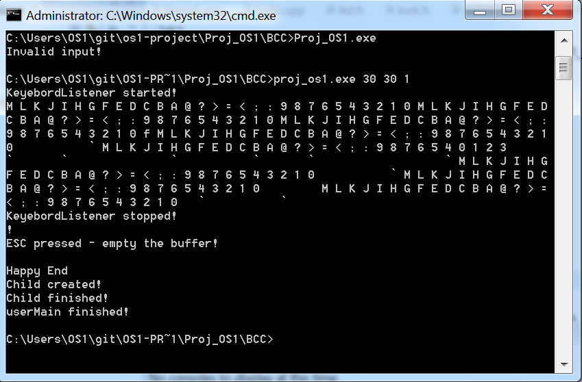

# Operating System Kernel for 8086 architecture
- Implementation of a small, but completely functional operating system kernel.
- Supports concepts such as multi-threading, preemption, time sharing, semaphores and events

